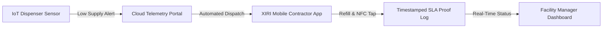

## The Promise of the Smart Restroom

Few tenant complaints escalate faster than an empty paper towel dispenser or a malfunctioning soap pump at 9:15 AM. 

For tech-leaning facility managers, the solution seems obvious: **IoT-enabled smart dispensers**. Systems like Tork Vision Cleaning, Kimberly-Clark Onvation, and Georgia-Pacific Kaptivate embed infrared, ultrasonic, or weight sensors directly into soap dispensers, paper towel cabinets, and tissue holders.

When supply drops below 20%, the dispenser sends a cellular or LoRaWAN alert to a facility dashboard, notifying staff before a tenant ever notices.

Sounds revolutionary. But is it actually worth the investment for your commercial building?

---

## How IoT Consumable Dispensers Work

Smart restroom telemetry relies on three core technologies:

| Sensor Component | Technology Used | Operational Function |
| :--- | :--- | :--- |
| **Soap & Sanitizer Dispensers** | Infrared optical or capacitive liquid level sensors | Measures remaining fluid volume in milliliters; triggers low-refill alert at 15–20% capacity. |
| **Paper Towel & Tissue Dispensers** | Mechanical roll diameter switches or optical distance sensors | Tracks remaining roll diameter; calculates estimated sheet pulls remaining. |
| **Connectivity Hub** | Cellular gateway, LoRaWAN, or Bluetooth mesh | Transmits low-battery, low-supply, and jam alerts to a cloud management portal. |

---

## The Hidden Trap: "Alert Fatigue" Without Tech-Enabled Crews

Here is the truth that smart dispenser manufacturers won't tell you on their sales calls:

> **Hardware sensors only tell you a dispenser is empty. They do not refill it.**

If your commercial cleaning vendor or day porter operates on a rigid 1990s paper-checklist model, installing $3,000 worth of smart dispensers creates a new problem: **Alert Fatigue**.

Your facility portal receives 40 automated notifications a day:
- *"2nd Floor North Restroom Soap Low"*
- *"3rd Floor East Paper Towel Jammed"*
- *"1st Floor Lobby Tissue Depleted"*

If your cleaning crew doesn't have real-time mobile dispatch, SLA accountability, and digital proof-of-work, those alerts sit unaddressed in an inbox while tenants still experience empty dispensers.

---

## The XIRI Perspective: Hardware + Tech-Enabled Janitorial Governance

At XIRI Facility Solutions, we view IoT restroom sensors as half of the equation. To achieve a truly "smart" building, smart hardware must be paired with **Tech-Enabled Facility Governance**:

1. **Integrated Mobile Dispatch**: Sensor alerts auto-route directly to the assigned XIRI Day Porter or Night Manager's mobile device with precise room coordinates.
2. **NFC Verification Taps**: Cleaners verify their physical presence at the specific dispenser using NFC checkpoint tags (`/blog/how-nfc-tags-prevent-cleaning-fraud`), logging the exact time the refill occurred.
3. **Eliminating "Stub Roll Waste"**: Traditional janitorial crews throw away 15–25% full paper towel rolls on Friday afternoons to avoid weekend runouts. Smart dispenser data allows crews to leave rolls until truly depleted, reducing supply spend by up to 20% annually.

---

## When Should You Invest in IoT Restroom Dispensers?

### ✅ High-ROI Facilities:
- **High-Traffic Class A Office Towers** (100,000+ sq ft with dense daytime occupancy)
- **Public Community Libraries & Civic Hubs** (e.g., Great Neck Library system, where public traffic fluctuates wildly)
- **Airport Terminals & Transit Centers**
- **Large Healthcare & Outpatient Complexes**

### ❌ Low-ROI Facilities:
- Single-tenant offices under 10,000 sq ft (routine daily restocking by a reliable janitorial crew achieves the same outcome at zero hardware cost)
- Facilities with high turnover janitorial crews who refuse to adopt mobile technology

---

## Ready to Elevate Your Building's Technology Infrastructure?

Installing smart sensors is a great step — but pairing them with a **managed, tech-enabled cleaning partner** is what delivers flawless building operations.

XIRI Facility Solutions provides single-vendor facility management backed by real-time NFC verification, automated SLA tracking, and $1M-insured local crews.

[**Book a Free Facility Technology Audit →**](/calculator)
